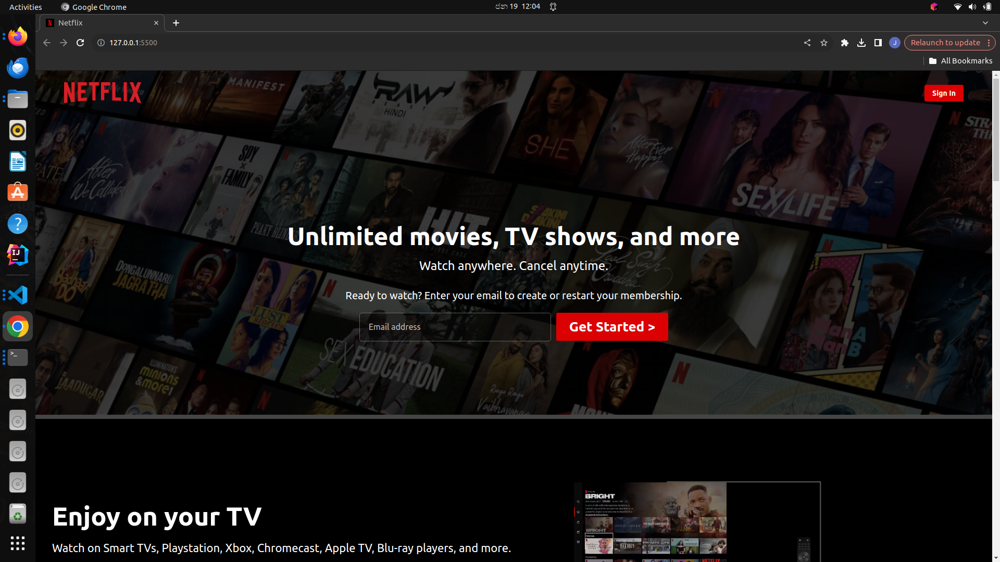

# Netflix Homepage Clone

This is a straightforward project aimed at recreating the design of the Netflix homepage using HTML and CSS.

"All product logos, designs, and trademarks, with the exception of the code, are copyrighted and belong to their respective owners."

## Table of Contents

- [Features]
- [Technologies Used]
- [Usage]

## Features

- A faithful recreation of the Netflix homepage.
- Basic search functionality..
- Responsive web design.
- Designed using HTML and CSS only.

# Technologies Used

- HTML5 
- CSS3
-  ionic
- Google Fonts

## Usage
User experience is intended to be similar to the Netflix homepage.
